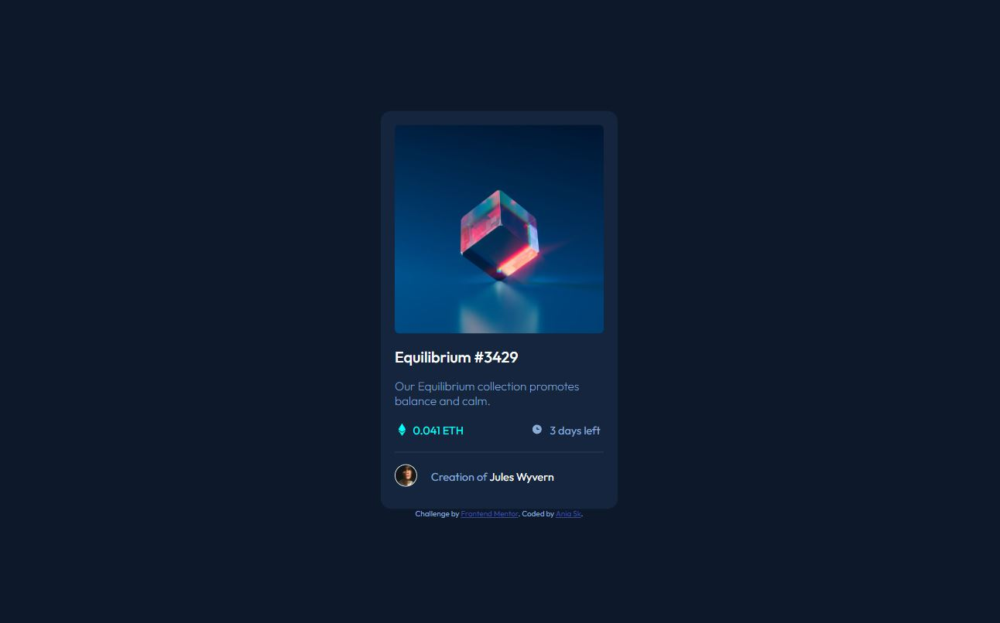

# Frontend Mentor - NFT preview card component solution

This is a solution to the [NFT preview card component challenge on Frontend Mentor](https://www.frontendmentor.io/challenges/nft-preview-card-component-SbdUL_w0U). Frontend Mentor challenges help you improve your coding skills by building realistic projects. 

## Table of contents

- [Overview](#overview)
  - [The challenge](#the-challenge)
  - [Screenshot](#screenshot)
  - [Links](#links)
- [My process](#my-process)
  - [Built with](#built-with)
  - [What I learned](#what-i-learned)  
- [Author](#author)


## Overview

### The challenge

Users should be able to:

- View the optimal layout depending on their device's screen size
- See hover states for interactive elements

### Screenshot




### Links

- Solution URL: [https://www.frontendmentor.io/solutions/nft-preview-card-component-G7_EKpGJj_](https://www.frontendmentor.io/solutions/nft-preview-card-component-G7_EKpGJj_)
- Live Site URL: [https://ania-sk.github.io/NFT-preview-card-component/](https://ania-sk.github.io/NFT-preview-card-component/)

## My process

### Built with

- Semantic HTML5 markup
- CSS custom properties
- Flexbox

### What I learned
- I learned how to use the hover selector.

```css
a:hover {
    color: hsl(178, 100%, 50%);
}
```
Changes the color of "a" elements when you hover over them.


- I learned how to bring another image/icon to the screen after hovering over the first image using the ::before and ::after pseudo-elements in CSS.


## Author

- Frontend Mentor - [@ania-sk](https://www.frontendmentor.io/profile/ania-sk)
